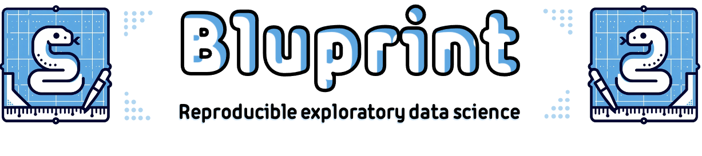

Bluprint
========

|CI_badge| |codecov_badge| |license_badge| |version_badge|

.. |CI_badge| image:: https://github.com/igor-sb/bluprint/actions/workflows/ci.yml/badge.svg
.. |codecov_badge| image:: https://codecov.io/gh/igor-sb/bluprint/graph/badge.svg?token=U44L2ASEIG
.. |license_badge| image:: https://img.shields.io/pypi/l/bluprint?color=blue
.. |version_badge| image:: https://img.shields.io/pypi/v/bluprint?color=blue

**Bluprint** is a command line utility for creating data science projects
following this template::

    my_project
    ├── conf                       # Project configuration
    │   ├── config.yaml            #  Access contents with: load_data_yaml()
    │   └── data.yaml              #  Access contents with: load_config_yaml()
    ├── data                       # Data whose paths stored in conf/data.yaml
    │   ├── emailed
    │   │   └── messy.xlsx
    │   └── user_processed.csv
    ├── notebooks                  # Notebooks which can be organized in sub-folders
    │   └── process.ipynb
    └── my_project                 # Access code with: import my_project.shared_code
        └── data_transform.py

It follows best coding practices to separate analysis notebooks from
paths to data, configuration and other Python code.

Configuration and data paths are stored in YAML files:

+----------------------------------------+----------------------------------------+
| conf/data.yaml                         | conf/config.yaml                       |
+----------------------------------------+----------------------------------------+
|                                        |                                        |
|.. code:: yaml                          |.. code:: yaml                          |
|                                        |                                        |
|    emailed:                            |    google:                             |
|        messy: 'emailed/messy.xlsx'     |        url: 'www.google.com'           |
|    user:                               |        port: 22                        |
|        processed: 'user_processed.csv' |        description: 'Search engine'    |
|                                        |                                        |
+----------------------------------------+----------------------------------------+

and the processing code is availabe as a Python module my_project/data_transform.py:

.. code:: python

    def process_data(df):
      return(
        df
        .assign(value=df['ValuE'] - 1)
      )

Use `load_data_yaml()` to import the YAML file and access it using dot notation
or as a dictionary. Shared code is accessible as a Python module:

.. code:: python

    from bluprint.config import load_config_yaml, load_data_yaml

    # Access configuration from conf/config.yaml
    config = load_config_yaml()
    print(f'URL: {config.google.url}, port: {config.google.port}')

    # Access data without worrying about file paths
    import pandas as pd
    data = load_data_yaml()
    messy_df = pd.read_xlsx(data.emailed.messy)

    # Bluprint defines my_project folder as a Python module accessible
    # to any notebook anywhere in this project.
    from my_project.shared_code import transform_data
    transformed_df = transform_data(messy_df)

    # Save output
    transformed_df.to_csv(data.user.processed)

For a working demonstration of a shareable project see
https://github.com/igor-sb/bluprint-demo/.

Features
--------

- Write portable notebooks by separating code from configuration - file paths are in YAML configs, loaded
  with `load_data_yaml() <https://igor-sb.github.io/bluprint-conf/html/reference.html#bluprint_conf.data.load_data_yaml>`_
  and `load_config_yaml() <https://igor-sb.github.io/bluprint-conf/html/reference.html#bluprint_conf.config.load_config_yaml>`_
- R/Python packages are version-locked with `renv <https://rstudio.github.io/renv/>`_
  and `uv <https://docs.astral.sh/uv/>`_
- Import packaged code as Python modules
- Packaged code can be shared across different projects with `pip install <https://igor-sb.github.io/bluprint/prod_projects.html>`_
- Use both Python and R notebooks in a single project (see
  `Python/R projects </https://igor-sb.github.io/bluprint/getting_started.html#python-r-projects>`_)
- Share entire projects by copying a project directory and running
  *uv venv && uv sync*
- Works with common data science IDEs (RStudio, VSCode), notebook tools for linting (`nbqa <https://nbqa.readthedocs.io/en/latest/>`_),
  notebook version control (`nbstripout <https://github.com/kynan/nbstripout>`_)
  or workflows (`Ploomber <https://github.com/ploomber/ploomber>`_)

Documentation
-------------

Full documentation available at: https://igor-sb.github.io/bluprint/.

Installation
------------

Install `uv 0.4.12 <https://docs.astral.sh/uv/>`_ which is a last confirmed
working version and run ``uv tool install bluprint``.

For R projects, `renv <https://rstudio.github.io/renv/>`_ R package is required
for creating Bluprint projects with R support.

References
----------

Bluprint integrates `uv <https://docs.astral.sh/uv/>`_,
`OmegaConf <https://omegaconf.readthedocs.io/>`_, Python's native import system
`importlib <https://docs.python.org/3/library/importlib.html>`_, R packages
`{renv} <https://rstudio.github.io/renv/>`_,
`{here} <https://here.r-lib.org/>`_ and
`{reticulate} <https://rstudio.github.io/reticulate/>`_.

Bluprint is inspired by these resources:

* `Cookiecutter Data Science <https://drivendata.github.io/cookiecutter-data-science/>`_
* `RStudio Projects <https://support.posit.co/hc/en-us/articles/200526207-Using-RStudio-Projects>`_
* `Ploomber <https://github.com/ploomber/ploomber>`_
* `Microsoft Team Data Science Process <https://learn.microsoft.com/en-us/azure/architecture/data-science-process/overview>`_
* `R for Data Science (2e): 6. Workflow: scripts and projects <https://r4ds.hadley.nz/workflow-scripts.html>`_
* `Vincent D. Warmerdam: Untitled12.ipynb | PyData Eindhoven 2019 <https://www.youtube.com/watch?v=yXGCKqo5cEY>`_

License
-------

Bluprint is released under `MIT license <LICENSE>`_.
